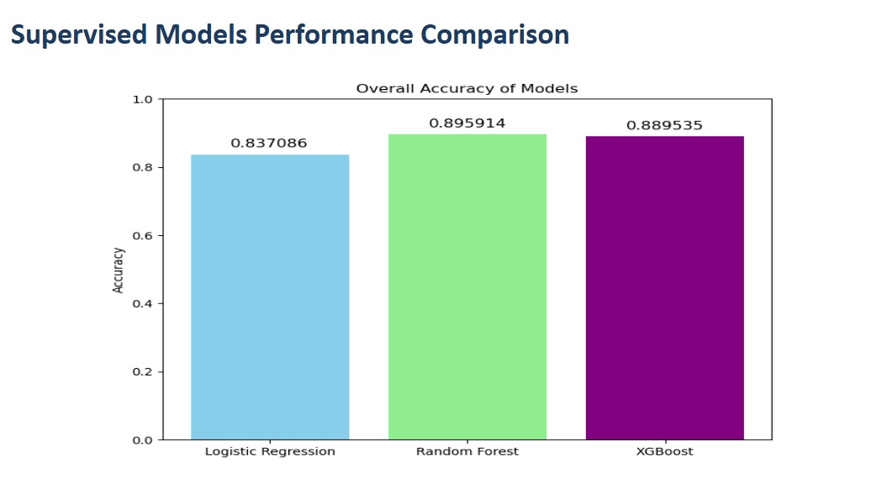
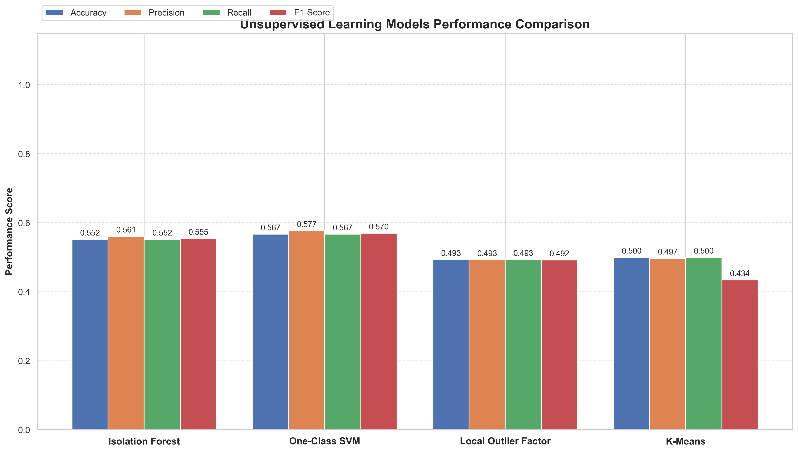

# Manual for Flow Behavior Profiling

## Overview

Flow Behavior Profiling is a network traffic analysis and classification system developed to profile network flows based on their behavioral patterns. The system classifies traffic into categories such as normal, suspicious, and attack-like behavior using a hybrid detection architecture.

The project combines rule-based heuristics, supervised machine learning, and unsupervised anomaly detection to improve classification accuracy and support real-time traffic monitoring. The system captures live network flows, processes them through trained models, and displays the classification results on a web-based dashboard.

## Objective

The objective of this project is to perform flow behavior profiling and traffic classification using machine learning techniques and real-time network flow analysis.

The system is designed to:

- Analyze network traffic behavior
- Detect malicious or suspicious traffic patterns
- Classify traffic flows into predefined behavioral categories
Support real-time monitoring and anomaly detection

## Features
- Real-time network traffic profiling using live flow extraction (CICFlowMeter)
- Hybrid detection pipeline combining rule-based heuristics, Random Forest classification, and Isolation Forest anomaly detection
- Dedicated dashboard sections for each traffic type (Normal, Suspicious, Attack-like) for better analysis and monitoring
- Option to select active network interface (e.g., WiFi, Ethernet) for live traffic capture
- Behavioral classification of traffic into Normal, Suspicious, and Attack-like categories
- End-to-end flow-based analysis from packet capture to real-time dashboard visualization
- Live communication between backend and frontend using WebSockets for instant updates

## Dataset

The project uses the CICIDS2017 dataset collected from Kaggle:
https://www.kaggle.com/datasets/ernie55ernie/improved-cicids2017-and-csecicids2018

The dataset contains realistic network traffic generated under both benign and attack scenarios.
The dataset includes multiple attack categories such as:

- DDoS
- DoS attacks
- Port scanning
- Botnet traffic
- Web attacks
- Brute force attacks
- Infiltration attacks
- Heartbleed attacks
- SSH and FTP attacks

## Classification Labels

The system maps granular network occurrences and complex attack vectors into four distinct top-level categories. This categorization helps operators quickly distinguish between benign usage, security infrastructure bugs, minor network reconnaissance, and active compromises.

### 1. Normal
Benign operational traffic matching standard day-to-day transaction profiles without structural anomalies.

### 2. Suspicious
Early indicators of network discovery or minor structural anomalies that require tracking but do not confirm an active break-in. This includes:
- Portscan
- Infiltration - Portscan

### 3. Misconfigured
Traffic streams generated due to structural mismatches, timeouts, or application-level bugs rather than malicious intent. This helps distinguish network errors from real threats. This includes:
- Dead Service
- TCP Handshake Errors
- Keep Alive Timeout
- MTU Mismatch

### 4. Attack-like
Volumetric floods, remote unauthorized command executions, or targeted application exploits. This includes:
- Volumetric and Denial of Service (DDoS, DoS Hulk, DoS GoldenEye, DoS Slowloris, DoS Slowhttptest)
- Brute Force & Access Attempts (FTP-Patator, SSH-Patator)
- Infiltration and Botnet infrastructure traffic
- Web Attacks (SQL Injection, Cross-Site Scripting / XSS, Brute Force exploits)
- Specialized vulnerabilities like Heartbleed

## ML Model Selection

Multiple supervised and unsupervised machine learning models were trained on the CICIDS2017 dataset to evaluate performance for traffic classification and anomaly detection.

Supervised models were used for labeled traffic classification, while unsupervised models were used to detect unknown or anomalous behavior.

- After evaluation, Random Forest was selected for classification due to its performance and robust behavior across network classes.

- Isolation Forest was selected for anomaly detection due to its fast and effective detection in high-volume, unknown traffic scenarios.

## Rule-Based Heuristic System

A rule-based heuristic layer acts as the first stage of our traffic classification pipeline, designed to prioritize speed and optimize computational overhead. The moment a network flow is logged, it is subjected to high-speed algorithmic conditions executed natively in Python. 

This layer bypasses complex machine learning matrix calculations by auditing blatant, structural network anomalies against predefined baseline thresholds:
- **Port Validation:** The system continuously monitors critical destination ports. For example, if an intense burst of traffic selectively targets administrative ports like 445 (SMB) or 22 (SSH) using irregular TCP flag states, the rule engine intercepts and flags it immediately.
- **Volumetric Filtering:** High-velocity traffic patterns are evaluated against rigid transaction caps. If a connection's packet transmission rate spikes past a threshold that standard user activity cannot physically produce, the heuristic layer takes action.

If an incoming flow explicitly violates any of these foundational boundaries, it is instantly tagged with its respective classification label (such as Suspicious or Misconfigured) and skips the machine learning layer entirely. This saves significant CPU processing power during high-volume traffic events.

## System Architecture and Execution Flow

The system uses a decoupled, event-driven architecture to parse and display real-time network states cleanly. The operation flows sequentially through the frontend, integration bridge, and backend analytical engine.

### System Initialization
The operation begins on the frontend interface when the operator chooses a network interface and starts the monitor. The configuration details are emitted across a persistent WebSocket bridge using Socket.io-client to the backend server.

### Traffic Capture Subprocess
Upon receiving the start command, the Flask API initializes an isolated background subprocess running CICFlowMeter. Isolating this component ensures that intensive packet sniffing and feature aggregation never lock up the web services or block user input. The sniffer parses raw packet bursts into structured flows and constantly streams updates into a local data file (`live_flows.csv`).

### The Two-Stage Hybrid Pipeline
The backend engine continuously watches the local data log for newly appended lines. When new flow metrics are detected, they enter a multi-layered evaluation loop that balances lightweight processing with deep analytical profiling:

1. **Stage 1 - Rule-Based Filtering:** The flow metrics are parsed by high-speed heuristics to catch known anomalies and port violations instantly. Flows that trip these hardcoded rules are immediately categorized and routed directly to the output stream.
2. **Stage 2 - Hybrid Machine Learning Analysis:** Any flow that clears the heuristic filters is passed down to the machine learning stack. Here, the data is evaluated across dozens of statistical dimensions using a dual-model framework:
   - *Random Forest (Supervised Classification):* Matches the fine-grained signature patterns of the traffic against known threat vectors from the CICIDS2017 dataset, such as volumetric DDoS, slow-rate DoS, web exploits, and botnet behavior.
   - *Isolation Forest (Unsupervised Anomaly Detection):* Explicitly isolates rare and structurally distinct traffic profiles to catch novel system errors, zero-day threats, or evolving attack methods that standard signature rules might miss.

### Live Dashboard Updates
Once classification finishes, the backend packages the flow data and prediction labels into a lightweight JSON object. Flask-SocketIO pushes this payload over the open WebSocket connection instantly. The React frontend reads the incoming stream, dynamically updates individual component states, and increments the status counters on the UI without requiring a page refresh.

## Tech Stack

| Component                     | Technology         | Purpose                                                                 |
|-------------------------------|--------------------|-------------------------------------------------------------------------|
| **Programming Language**      | Python             | Core implementation of backend logic and machine learning pipeline      |
| **Machine Learning Models**   | Scikit-learn       | Training and deployment of Random Forest and Isolation Forest models    |
| **Data Processing**           | Pandas, NumPy      | Data cleaning, preprocessing, and feature engineering                   |
| **Network Flow Extraction**   | CICFlowMeter       | Capturing real-time network traffic and generating flow-based features  |
| **Backend API**               | Flask              | Handling API requests and serving model predictions                     |
| **Real-time Communication**   | Flask-SocketIO     | WebSocket-based live communication between backend and frontend         |
| **Frontend Dashboard**        | React.js           | Visualization of traffic flows and classification results               |

## System Requirements

The system requires a standard development environment capable of running Python-based machine learning services, frontend applications, and real-time network flow processing.

- Python 3.8 or above
- Node.js 14 or above
- npm (latest version)
- Git for version control
- CICFlowMeter for real-time network flow extraction
- Minimum 8GB RAM recommended for smooth model execution and real-time processing

## Acknowledgements
This project was developed as part of the **HPE CPP-3 Program**. Gratitude to the mentors for their support and guidance throughout the development process, which helped in building and understanding a real-world system involving machine learning, network traffic analysis, and full-stack development.

## Team Members

| Name              | GitHub Profile                                                  |
| ----------------- | --------------------------------------------------------------- |
| Divesh Jain       | [Diveshjain](https://github.com/Diveshjain005)                  |
| Hemangini Padia   | [HemanginiPadia](https://github.com/HemanginiPadia)             |
| Lakshya Gupta     | [lakshyagupta1335](https://github.com/lakshyagupta1335)         |
| Neelkanth Tiwadi  | [neelkanth-tiwadi](https://github.com/neelkanth-tiwadi)         |
| Vansh Verma       | [VanshSwaroopVerma](https://github.com/VanshSwaroopVerma)       |